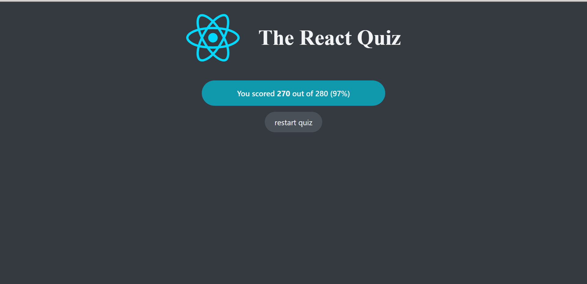

# React Quiz 🧠

A dynamic and interactive quiz application built with React.js using modern hooks (useReducer, useEffect) that fetches questions and provides an engaging quiz-taking experience with real-time feedback.

## 🌟 Features

- **State Management with useReducer**: Robust state management using React's useReducer hook for complex state logic
- **Dynamic Question Loading**: Fetches questions from a questions.json file located in the public/ folder, making it easy to update questions without changing the source code.
- **Interactive Quiz Flow**: Start screen → Active quiz → Results screen with smooth transitions
- **Real-time Score Tracking**: Instant point calculation based on correct answers
- **Progress Indicator**: Visual progress bar showing current question and accumulated points
- **Question-based Point System**: Each question has individual point values for weighted scoring
- **Answer Feedback**: Immediate visual feedback when selecting answers
- **Finish Screen**: Comprehensive results showing total points vs maximum possible points
- **Restart Capability**: Easy restart functionality to retake the quiz
- **Error Handling**: Graceful error handling for network requests
- **Loading States**: Smooth loading experience while fetching data
- **Responsive Design**: Fully responsive layout that works seamlessly on desktop, tablet, and mobile devices

## 🚀 Demo

[Live Demo](https://react-quiz-gamma-murex.vercel.app/)

## 📸 Screenshots




## 🛠️ Technologies Used

- **React.js** - Frontend library with hooks (useReducer, useEffect)
- **Vite** - Fast build tool and development server
- **JavaScript (ES6+)** - Modern JavaScript features with JSX
- **CSS3** - Component-based styling
- **Fetch API** - For HTTP requests to load questions
- **ESLint** - Code linting and formatting

## 📦 Installation

1. **Clone the repository**

   ```bash
   git clone https://github.com/alaa-okasha/react-quiz.git
   ```

2. **Navigate to the project directory**

   ```bash
   cd react-quiz
   ```

3. **Install dependencies**

   ```bash
   npm install
   ```

4. **Start the development server** (in a new terminal)

   ```bash
   npm run dev
   ```

5. **Open your browser and visit**
   ```
   http://localhost:5173
   ```

## 🎮 How to Use

1. Click the "Let's start" button to begin
2. Read each question carefully
3. Select your answer from the available options
4. Click "Next" to proceed to the next question
5. View your progress on the progress bar
6. Complete all questions to see your final score
7. Use "Restart Quiz" to try again

### Available Actions

- `dataReceived`: Load questions data
- `dataFailed`: Handle loading error
- `start`: Begin the quiz
- `newAnswer`: Record answer selection
- `nextQuestion`: Move to next question
- `finish`: Complete the quiz
- `restart`: Reset quiz to beginning
